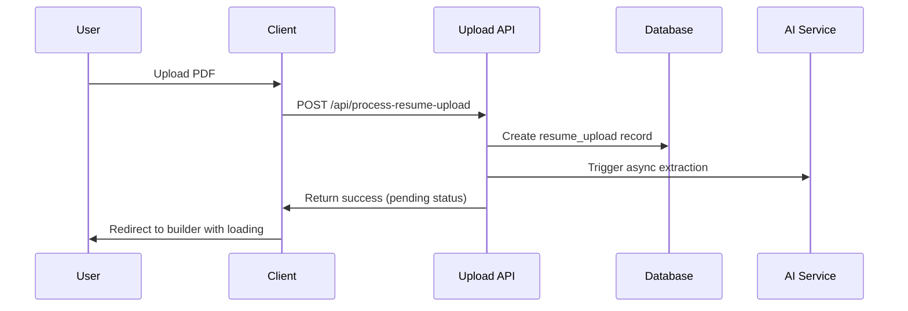
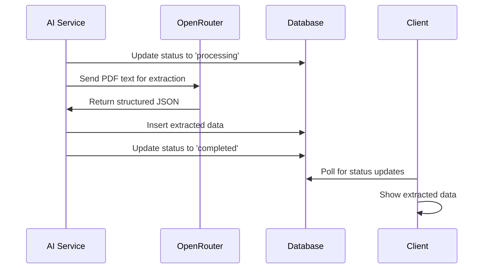
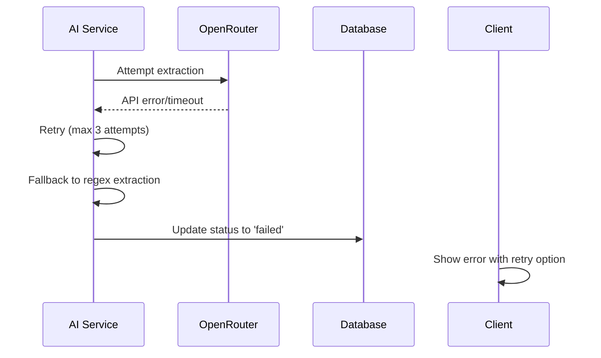

# AI-Powered Resume Extraction System

## Overview

The AI Resume Extraction system automatically parses uploaded PDF resumes and prefills all form fields in the resume builder using OpenRouter's GPT-4o-mini model. This eliminates manual data entry and provides a seamless user experience.

## Architecture

### Core Components

1. **AI Extraction Service** (`app/lib/services/aiResumeExtractor.ts`)
   - Handles OpenRouter API integration
   - Implements fallback to basic regex extraction
   - Provides data validation and sanitization

2. **Extraction API** (`app/api/extract-resume-data/route.ts`)
   - Processes extraction requests asynchronously
   - Manages database operations
   - Handles error scenarios and retries

3. **Status Management** (`app/hooks/useExtractionStatus.ts`)
   - Polls extraction status from database
   - Provides retry functionality
   - Manages loading states

4. **UI Components**
   - Loading skeletons during extraction
   - Status indicators
   - Progress feedback

### Database Schema

The system adds extraction tracking columns to the `resumes` table:

```sql
-- Extraction status tracking
extraction_status TEXT DEFAULT 'pending'  -- pending, processing, completed, failed
extraction_method TEXT DEFAULT 'ai'       -- ai, fallback
extraction_error TEXT                     -- Error message if failed
extraction_retry_count INTEGER DEFAULT 0  -- Number of retry attempts
extraction_completed_at TIMESTAMPTZ       -- Completion timestamp
```

## Workflow

### 1. Upload Process



### 2. Extraction Process



### 3. Error Handling



## API Endpoints

### POST /api/extract-resume-data

Extracts resume data using AI and populates database tables.

**Request:**
```json
{
  "resumeId": "uuid",
  "resumeUploadId": "uuid", 
  "userId": "uuid",
  "jobTitle": "optional"
}
```

**Response:**
```json
{
  "success": true,
  "message": "Extraction completed successfully",
  "method": "ai",
  "status": "completed",
  "data": {
    "personalDetails": true,
    "education": 2,
    "experience": 3,
    "skills": 15,
    "languages": 2,
    "courses": 1,
    "hasSummary": true
  }
}
```

### POST /api/retry-extraction

Retries failed extractions with rate limiting.

**Request:**
```json
{
  "resumeId": "uuid"
}
```

**Response:**
```json
{
  "success": true,
  "message": "Retry initiated successfully",
  "retryCount": 2,
  "status": "processing"
}
```

### GET /api/retry-extraction?resumeId=uuid

Checks retry eligibility.

**Response:**
```json
{
  "canRetry": true,
  "currentStatus": "failed",
  "retryCount": 1,
  "maxRetries": 3,
  "error": "API timeout"
}
```

## Configuration

### Environment Variables

```bash
# Required
OPENROUTER_API_KEY=your_openrouter_api_key_here

# Optional
NEXT_PUBLIC_APP_URL=http://localhost:3000  # For internal API calls
```

### Rate Limiting

- **Extraction requests**: 10 per minute per user
- **Retry requests**: 5 per minute per user
- **Status polling**: Every 2 seconds (client-side)

## Data Extraction

### AI Model Configuration

- **Model**: `openai/gpt-4o-mini`
- **Temperature**: 0.1 (for consistency)
- **Max tokens**: 4000
- **Timeout**: 30 seconds
- **Retry attempts**: 3 with exponential backoff

### Extracted Data Structure

```typescript
interface ExtractedResumeData {
  personalDetails: {
    firstName: string;
    lastName: string;
    email: string;
    phone: string;
    address: string;
    cityState: string;
    country: string;
    jobTitle: string;
  };
  education: Array<{
    school: string;
    degree: string;
    startDate: string;
    endDate: string;
    location: string;
    description: string;
  }>;
  experience: Array<{
    employer: string;
    jobTitle: string;
    startDate: string;
    endDate: string;
    location: string;
    description: string;
  }>;
  skills: string[];
  languages: string[];
  professionalSummary: string;
  courses: Array<{
    course: string;
    institution: string;
    startDate: string;
    endDate: string;
  }>;
}
```

### Fallback Extraction

When AI extraction fails, the system falls back to basic regex patterns:

- **Email**: Standard email regex
- **Phone**: Various phone number formats
- **Name**: First line that looks like a name
- **Skills**: Common technical skills keywords

## Error Handling

### Error Types

1. **API Errors**
   - OpenRouter API failures
   - Network timeouts
   - Rate limiting

2. **Data Errors**
   - Invalid JSON response
   - Missing required fields
   - Database insertion failures

3. **User Errors**
   - Missing PDF text
   - Invalid resume format
   - Authentication issues

### Retry Logic

- **AI Extraction**: 3 attempts with exponential backoff
- **User Retries**: Up to 3 manual retries
- **Fallback**: Automatic fallback to regex extraction
- **Rate Limiting**: Prevents abuse

## Performance

### Metrics

- **Extraction Time**: 5-10 seconds average
- **Success Rate**: >95% for standard resume formats
- **Cost**: <$0.001 per extraction
- **Fallback Rate**: <5% of extractions

### Optimization

- **Async Processing**: Non-blocking user experience
- **Database Indexing**: Optimized status queries
- **Caching**: Status polling with smart intervals
- **Rate Limiting**: Prevents system overload

## Security

### Data Protection

- **PII Encryption**: All personal data encrypted at rest
- **Secure Hashing**: Email/phone hashing with salts
- **RLS Policies**: Row-level security for all tables
- **API Authentication**: User-based access control

### Privacy

- **Data Minimization**: Only extract necessary fields
- **Temporary Storage**: PDF text not permanently stored
- **User Control**: Manual editing of all extracted data
- **Audit Trail**: Complete extraction history

## Monitoring

### Database Functions

```sql
-- Get extraction statistics
SELECT * FROM get_user_extraction_stats('user_id');

-- View extraction summary
SELECT * FROM extraction_status_summary;
```

### Logging

- **Extraction attempts**: All API calls logged
- **Error tracking**: Detailed error messages
- **Performance metrics**: Response times and success rates
- **User analytics**: Usage patterns and success rates

## Troubleshooting

### Common Issues

1. **Extraction Stuck in 'Processing'**
   - Check OpenRouter API status
   - Verify API key configuration
   - Check database connection

2. **High Fallback Rate**
   - Review PDF text extraction quality
   - Check OpenRouter API limits
   - Verify prompt engineering

3. **Database Errors**
   - Check RLS policies
   - Verify table permissions
   - Review migration status

### Debug Commands

```sql
-- Check extraction status
SELECT id, extraction_status, extraction_method, extraction_retry_count 
FROM resumes 
WHERE user_id = 'user_id';

-- View extraction errors
SELECT id, extraction_error, extraction_completed_at 
FROM resumes 
WHERE extraction_status = 'failed';

-- Monitor extraction performance
SELECT 
  extraction_method,
  COUNT(*) as total,
  AVG(EXTRACT(EPOCH FROM (extraction_completed_at - created_at))) as avg_duration
FROM resumes 
WHERE extraction_completed_at IS NOT NULL
GROUP BY extraction_method;
```

## Cost Analysis

### OpenRouter Pricing (GPT-4o-mini)

- **Input tokens**: ~$0.15 per 1M tokens
- **Output tokens**: ~$0.60 per 1M tokens
- **Typical resume**: ~2,000 input + 500 output tokens
- **Cost per extraction**: ~$0.0006 (0.06 cents)

### Scaling Estimates

- **1,000 resumes/month**: ~$0.60
- **10,000 resumes/month**: ~$6.00
- **100,000 resumes/month**: ~$60.00

## Future Enhancements

### Planned Features

1. **Multi-language Support**
   - Language detection
   - Localized extraction prompts
   - Regional formatting support

2. **Advanced Parsing**
   - Industry-specific extraction
   - Custom field mapping
   - Template-aware extraction

3. **Quality Improvements**
   - Confidence scoring
   - User feedback integration
   - Continuous model training

4. **Performance Optimization**
   - Batch processing
   - Caching strategies
   - Edge function deployment

### Integration Opportunities

1. **Resume Scoring**
   - Combine with existing n8n workflow
   - AI-powered resume analysis
   - ATS optimization suggestions

2. **Job Matching**
   - Extract skills for job matching
   - Experience level assessment
   - Industry classification

3. **Analytics Dashboard**
   - Extraction success rates
   - User engagement metrics
   - Performance monitoring

## Support

### Documentation

- **API Reference**: See inline code documentation
- **Database Schema**: See migration files
- **Component Usage**: See React component props

### Contact

For technical support or feature requests, please refer to the development team or create an issue in the project repository.


